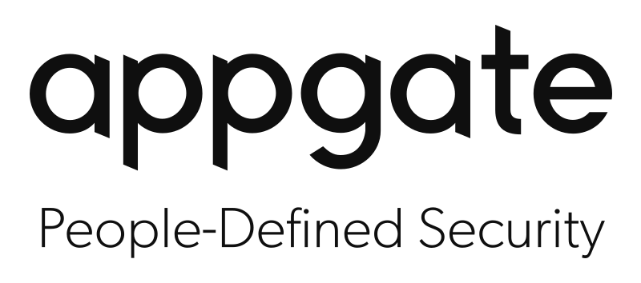

<p align="center">
  
</p>


# Introduction

An Appgate SDP Collective can be managed by a number of different means. Prior to v6.0 scripts were used for a number of these tasks. From v6.0 a new command line tool "sdpctl" has been introduced for managing various aspects of your Appgate SDP Collective. The most critical of these being backups (of the Controller) and upgrades (of the Collective). sdpctl is the recommended tool for managing these aspects of SDP once you are running v6.0.

Over time we will add more features to sdpctl so please be sure to always use the latest version.

# Installation

## macOS
Download the latest [macOS build](https://github.com/appgate/sdpctl/releases/latest) from the releases page. Then install using the command line:
```bash
# Unpack the downloaded package in the current directory
$ gunzip -c <path-to-downloaded-tar> | tar xopf -

# Install the binary
$ sudo mv <binary-path> /usr/local/bin/sdpctl
$ sudo chmod 0755 /usr/local/bin/sdpctl
```

## Windows
Download the latest [Windows build](https://github.com/appgate/sdpctl/releases/latest) from the releases page. Install using the command line:
```powershell
# Create a folder for the binary
PS> mkdir <folder-path>

# Unzip the downloaded archive
PS> Expand-Archive <path-to-archive> -DestinationPath <folder-path>

# Edit the PATH
PS> [Environment]::SetEnvironmentVariable("PATH", $Env:Path + ";<folder-path>", [EnvironmentVariableTarget]::Machine)
```
Then restart Powershell to make the changes take effect.

## Linux
**Debian based distributions:**
Download the latest [debian package](https://github.com/appgate/sdpctl/releases/latest) from the releases. Then install it:
```bash
$ sudo dpkg -i <path-to-downloaded-debian-package>
```

**Red Hat/Fedora:**
Download the latest [rpm package](https://github.com/appgate/sdpctl/releases/latest) from the releases page. Then install using this command:
```bash
$ sudo rpm -i <path-to-downloaded-rpm-package>
```

**Binary (Cross-platform)**
Download the appropriate version for your platform from sdpctl [releases](https://github.com/appgate/sdpctl/releases/latest). Once downloaded, the binary can be run from anywhere. You don’t need to install it into a specific location. This works well for shared hosts and other systems where you don’t have a privileged account.

Ideally, you should install it somewhere in your PATH for easy use. /usr/local/bin is the most probable location.

# Shell completion

The `sdpctl` tool supports shell completions for `bash`, `zsh`, `fish` and `PowerShell`. See the completion help command for more information on shell completions:
```
$ sdpctl completion --help
```

# Usage

## Initial setup
To start using `sdpctl`, you'll need to authenticate with your Appgate SDP Collective. The authentication process has two steps; first configure `sdpctl` and then authenticate by signing in to the Collective configured in the first step.

In case the Appgate SDP Collective you want to connect to has an unsigned certificate, you can use the `--pem` flag with a path to the certificate PEM when configuring.

See the [configuration documentation](./docs/configure.md) for a more detailed description on how to use the `configure` command.

Example:
```bash
# Initial configuration
$ sdpctl configure
? Enter the url for the controller API (example https://appgate.controller.com/admin)

# Configure using an unsigned certificate
$ sdpctl configure --pem=<path to PEM>
? Enter the url for the controller API (example https://appgate.controller.com/admin)

# Sign in
$ sdpctl configure signin
```

You can also manage multiple Appgate SDP Collectives using `sdpctl`. See the [authentication documentation](./docs/configure.md#working-with-multiple-appgate-sdp-collectives) for more information.

---
## The `appliance` command
The `appliance` command in `sdpctl` is used for appliance management tasks, such as backing up or upgrading appliances. The appliance command requires at least one action command following it. Executing the appliance command without an action command will print the help text for the command.

See the [appliance command documentation](./docs/appliance.md) for a more detailed description

### Examples
```bash
# Listing appliances
$ sdpctl appliance list

# Backing up appliances
$ sdpctl appliance backup

# Upgrading appliances
$ sdpctl appliance upgrade prepare --image=<appliance-image>
$ sdpctl appliance upgrade complete
```

---
## The `token` command
The token command let's you list and revoke device tokens according to the options specified. To revoke a single token, use these commands:
```bash
# List the current tokens
$ sdpctl token list
Distinguished Name                                     Device ID                             Last Token Issued At         Provider Name  Username
------------------                                     ---------                             --------------------         -------------  --------
CN=8401189b492f4d76b6671a9ba03b4ce1,CN=admin,OU=local  8401189b-492f-4d76-b667-1a9ba03b4ce1  2022-02-21T07:22:12.375464Z  local          admin

# Revoke the token
$ sdpctl token revoke CN=8401189b492f4d76b6671a9ba03b4ce1,CN=admin,OU=local
```

More details on the token command can be found in [the token command documentation](./docs/token.md)

---

### logs

A log file is generated and store locally, the location differs depending on your operating system.

For Unix `$HOME/.config/sdpctl/sdpctl.log` (or `$HOME/.config/sdpctl/profiles/{name}/sdpctl.log`)

For Windows `%LocalAppData%\sdpctl` (or `%LocalAppData%\sdpctl\profiles\{name}\sdpctl.log`)

For macOS `~/Library/Application\ Support/sdpctl/sdpctl.log` (or `~/Library/Application\ Support/sdpctl/profiles/{name}/sdpctl.log`)

---

## Other available commands

### `sdpctl open`
The open command will attempt to open the Appgate SDP Collective administration interface in the systems default browser.

### `sdpctl help [command]`
The help command will print the help page for any command that follows.

---
## Global flags
| Flag | Shorthand | Description |
|---|---|---|
| `--api-version` | none | peer API version override |
| `--debug` | none | Enable debug output and logging |
| `--no-verify` | none | Don't verify TLS on for this particular command, overriding settings from config file. USE WITH CAUTION! |

# Support

You can open a [github issue](https://github.com/appgate/sdpctl/issues) or contact support@appgate.com
